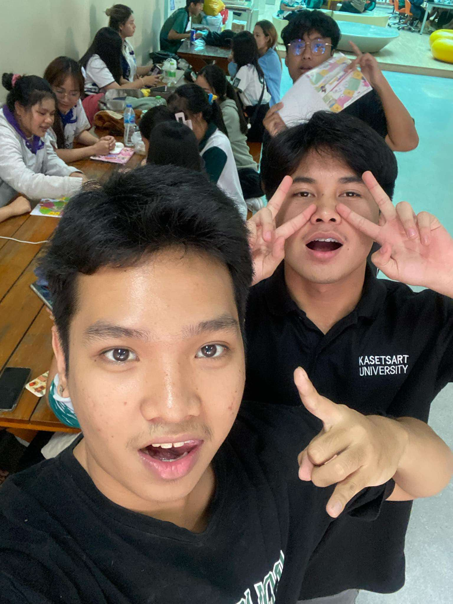
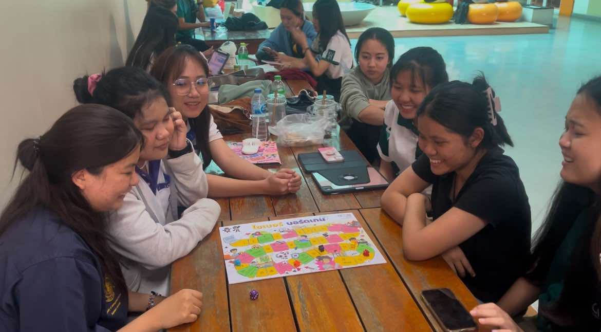
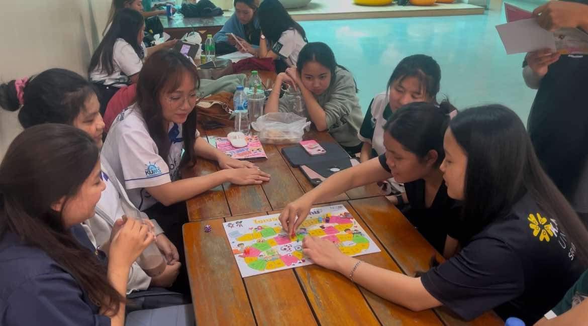
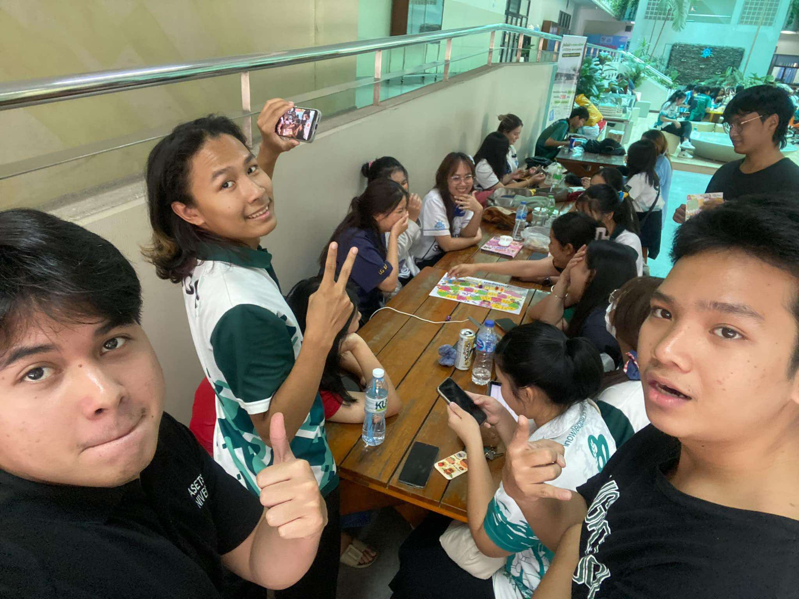
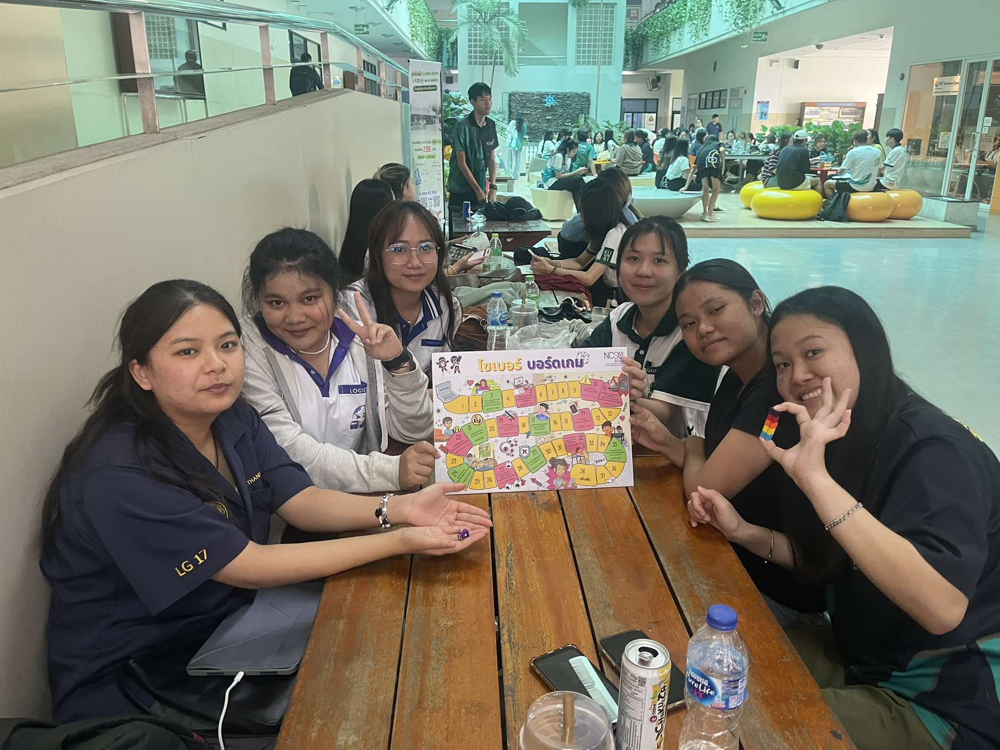

# Securing the Human
## กลุ่ม: Seksan-Salahsakul

---

## **✨ ภาพกิจกรรม**
### **ภาพกิจกรรม**
1. 
2. )
3. )
4. )

กิจกรรมนี้จัดขึ้นโดยกลุ่ม **"Seksan-Salahsakul"** ซึ่งเป็นนิสิตจากสาขาวิทยาการคอมพิวเตอร์ (Computer Science) โดยมีวัตถุประสงค์เพื่อสร้างความตระหนักรู้เกี่ยวกับโลกไซเบอร์ผ่านการเล่น **Boardgame Cyber จาก NCSA** 

กิจกรรมนี้ได้ดำเนินร่วมกับกลุ่มตัวอย่าง **นิสิตคณะวิทยาการจัดการ สาขาการจัดการโลจิสติกส์ ชั้นปีที่ 3 จำนวน 6 คน** โดยมีกระบวนการบันทึกภาพและวิดีโอ ซึ่งได้รับการอนุญาตจากกลุ่มนิสิตเรียบร้อยแล้ว

---

## **📅 วันที่และสถานที่จัดกิจกรรม**
- **วันเวลา**: วันจันทร์ที่ 21 มกราคม 2025  
- **สถานที่**: ตึก 10 มหาวิทยาลัยเกษตรศาสตร์ วิทยาเขตศรีราชา

---

## **📖 สิ่งที่ได้รับจากกิจกรรม Boardgame**
- **🎮 ความสนุกสนาน**: นิสิตที่เข้าร่วมเพลิดเพลินและสนุกสนานกับกิจกรรม
- **📴 พักสายตา**: ลดเวลาอยู่หน้าจอและเทคโนโลยี
- **🗣️ แลกเปลี่ยนความคิดเห็น**: เปิดโอกาสในการพูดคุยและแลกเปลี่ยนมุมมองในประเด็นเกี่ยวกับโลกไซเบอร์
- **⚠️ ความตระหนักรู้**: เข้าใจถึงความเสี่ยงและผลกระทบที่อาจเกิดขึ้นในโลกไซเบอร์

---

## **🌈 ภาพรวมของกิจกรรม**
- **📸 ภาพรวมจบกิจกรรม**:  
  )  

- **🎥 วิดีโอกิจกรรม**: [คลิกเพื่อดูวิดีโอ](https://youtu.be/jQjWgcT8QnA?si=njWl4ED7XrX26aYa)

---

## **👥 สมาชิกกลุ่ม Seksan-Salahsakul**
1. ✨ **Tante Wanitchakorn**
2. ✨ **Poramet Obyam**
3. ✨ **Vorapol Boonrasri**  → [Github Page](https://Vorxp.github.io/boardgame)
4. ✨ **Wasawat Boonporn**
