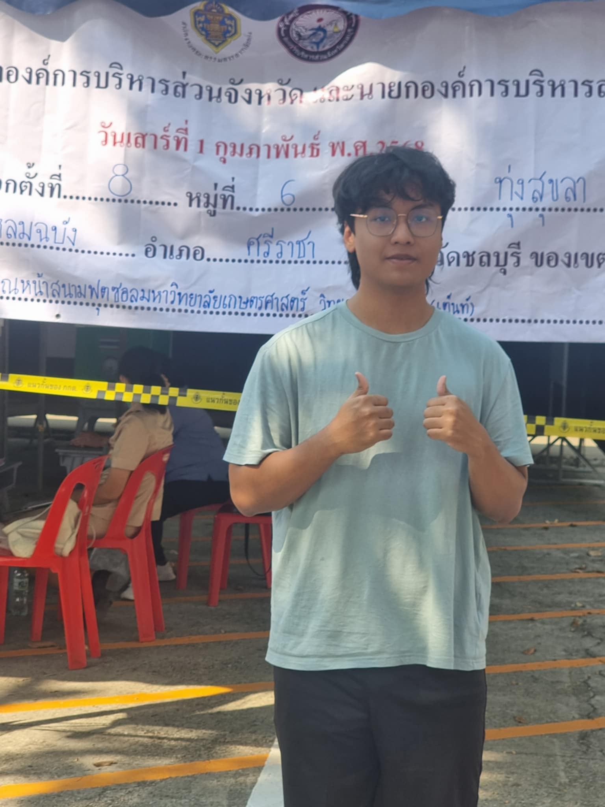

# สำรวจการเลือกตั้ง

## การเลือกตั้งสมาชิกสภาองค์บริหารและนายกองค์บริหารจังหวัด

**📅 วันที่: เสาร์ที่ 1 กุมภาพันธ์ 2568**  
**📍 สถานที่: หน้าสนามฟุตซอล ม.เกษตรศาสตร์ ศรีราชา**

---

## ประสบการณ์เซอร์เวย์เลือกตั้ง 🎉

การได้เข้าร่วมสังเกตการณ์การเลือกตั้งครั้งนี้เป็นประสบการณ์ที่มีคุณค่าอย่างยิ่ง 🗳️ เราได้เห็นกระบวนการเลือกตั้งที่โปร่งใสและการมีส่วนร่วมของประชาชนที่ออกมาใช้สิทธิ์ของตนเองอย่างเต็มที่

### สิ่งที่ได้รับและข้อคิดที่ได้
- ได้เห็นขั้นตอนการเลือกตั้งและกระบวนการจัดการที่เป็นระบบและโปร่งใส
- ได้พูดคุยกับเจ้าหน้าที่ประจำหน่วยเลือกตั้ง และเรียนรู้เกี่ยวกับการดำเนินงานของพวกเขา
- ได้รับรู้ถึงความสำคัญของสิทธิในการเลือกตั้งและผลกระทบต่อประชาธิปไตย

ถือเป็นประสบการณ์ที่มีคุณค่า ทำให้เข้าใจถึงความสำคัญของการเลือกตั้งและการมีส่วนร่วมของประชาชนในการกำหนดอนาคตของสังคม 🌟
