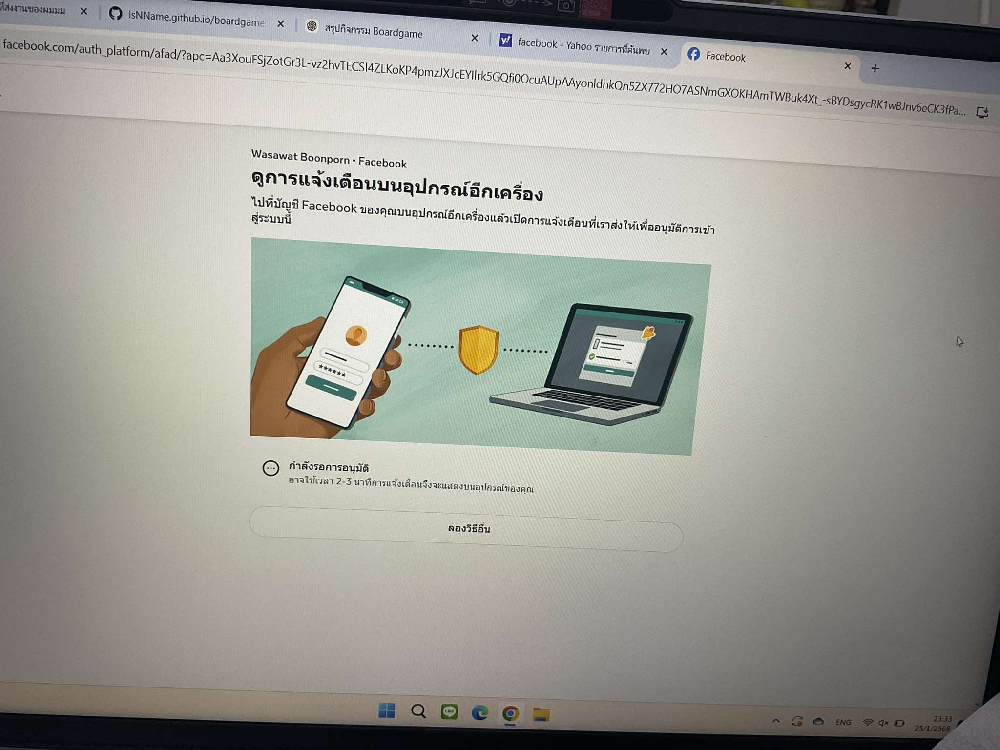

# Example of Security Controls in Daily Life
# OTP (One-Time Password)

### **สถานที่**: ใช้ในระบบยืนยันตัวตนออนไลน์ เช่น การทำธุรกรรมทางการเงิน การเข้าสู่ระบบแอปพลิเคชัน หรือการเปลี่ยนรหัสผ่าน

### **Types of Security Controls**: Logical Controls  
### **Control Functions**: Preventative

---

### **Key Features of OTP**:
- **Unique**: ใช้ได้เพียงครั้งเดียวและหมดอายุในเวลาที่กำหนด
- **Time-Sensitive**: มีระยะเวลาจำกัด เช่น 30 วินาที หรือ 1 นาที
- **Secure**: ลดความเสี่ยงในการถูกแอบอ้างหรือโจมตีจากผู้ไม่ประสงค์ดี

---

### **Common Usage**:
1. **Banking Transactions**: ใช้ยืนยันการโอนเงินหรือทำธุรกรรม
2. **Account Login**: ใช้ในกระบวนการยืนยันตัวตนแบบสองขั้นตอน (2FA)
3. **Password Reset**: ใช้เพื่อยืนยันก่อนเปลี่ยนรหัสผ่าน

---

### **Types of OTP Delivery Methods**:
- **SMS**: ส่งรหัสผ่านครั้งเดียวผ่านข้อความ
- **Email**: ส่งรหัสผ่านไปยังอีเมลผู้ใช้
- **Authenticator Apps**: เช่น Google Authenticator หรือ Authy

---

### **Security Best Practices**:
- อย่าเปิดเผย OTP ให้ผู้อื่น
- ใช้ OTP จากแหล่งที่เชื่อถือได้เท่านั้น
- หลีกเลี่ยงการใช้ OTP บนอุปกรณ์ที่ไม่ปลอดภัย
